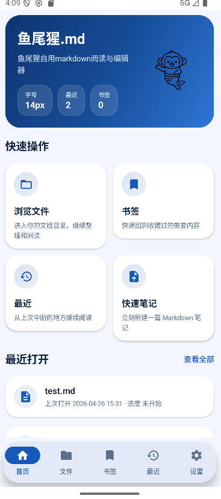
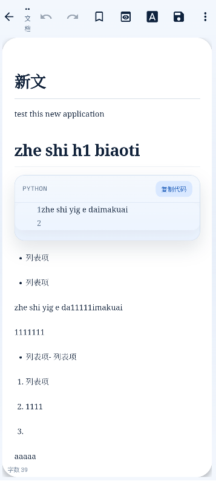

# 鱼尾猩.md

一个面向 Android 的本地 Markdown 阅读与编辑器。

现在这版已经不是“只能勉强阅读”的原型了，而是一个可用的自用文档工具：支持文件浏览、最近文件、书签、Markdown 编辑、沉浸式预览、目录大纲、图片插入、自动保存，以及分享导出。





## 当前能力

- 本地目录浏览与 Markdown 文件筛选
- 最近文件记录与阅读进度保存
- 书签收藏与快速回到文档
- Markdown 编辑工具栏
- 标题下拉：`H1` 到 `H5`
- 列表下拉：无序列表、有序列表
- 粗体、斜体、引用、代码块、链接、分隔线快捷插入
- 图片插入
- 自动保存
- Markdown 预览
- 目录大纲侧栏
- 代码块高亮、行号与复制
- 分享 Markdown 文件
- 导出 HTML
- 主题模式、字号、默认目录偏好设置

## 当前界面方向

- 品牌名：`鱼尾猩.md`
- 主视觉：蓝色 / 深蓝色文档工具风格
- 首页：品牌头图、快捷入口、最近打开、书签摘要
- 阅读器：写作为主，支持预览与分栏

## 技术栈

- Kotlin
- Jetpack Compose
- Navigation Compose
- Room
- DataStore
- CommonMark Java
- WebView

## 项目结构

```text
app/src/main/
├─ java/com/example/mdmobile/
│  ├─ data/
│  │  ├─ model/
│  │  └─ repository/
│  ├─ ui/
│  │  ├─ components/
│  │  ├─ screens/
│  │  └─ theme/
│  ├─ utils/
│  ├─ viewmodels/
│  ├─ MainActivity.kt
│  └─ MDMobileApp.kt
├─ assets/
├─ res/
└─ AndroidManifest.xml
```

## 运行方式

### Android Studio

1. 用 Android Studio 打开项目目录 `D:\mytools\MDMobile`
2. 等 Gradle 同步完成
3. 连接真机或启动模拟器
4. 点击 `Run`

### 命令行构建

```powershell
cmd /c C:\Users\ywx\.gradle\wrapper\dists\gradle-8.13-bin\5xuhj0ry160q40clulazy9h7d\gradle-8.13\bin\gradle.bat assembleDebug
```

构建完成后，调试安装包通常在：

`app/build/outputs/apk/debug/app-debug.apk`

## 系统要求

- Android 7.0+（SDK 24+）
- 推荐 Android 12+

## 当前已知情况

- 这是一个以本地文件为核心的应用，不依赖在线服务
- 某些旧页面和个别资源仍有历史遗留代码，可继续收口
- 当前构建可通过，但还有少量非阻塞 warning

## 隐私说明

应用主要在本地保存以下内容：

- 最近文件
- 书签
- 阅读进度
- 偏好设置

详细说明见：

`app/src/main/assets/privacy_policy.md`

## 后续可继续做的方向

- 更接近 Typora 的编辑体验
- 更完整的 Markdown 样式系统
- 图片块管理与附件面板
- 更精细的导出格式
- 平板与大屏布局继续优化

## License

MIT
